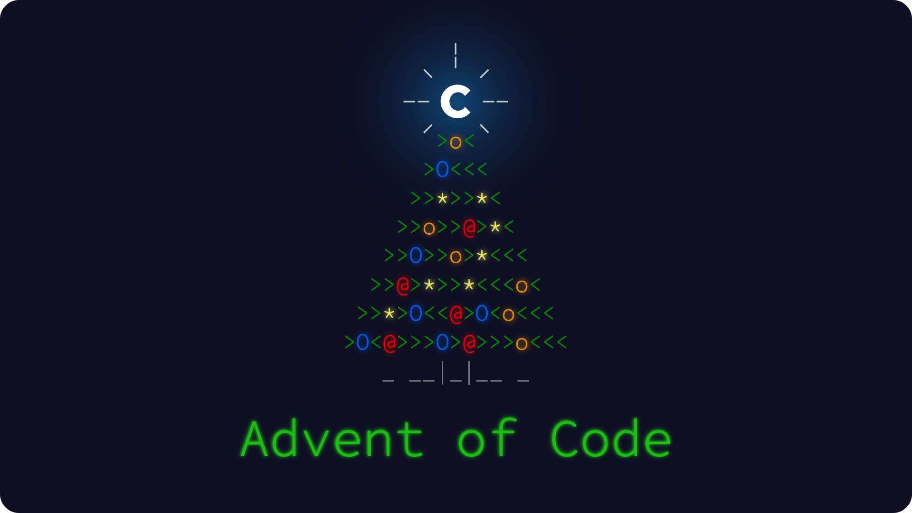

# 🎄 Advent of code


<br/>

This repository contains the solutions of the [**Advent of Code**](https://adventofcode.com/) challenges from 2024 in Python.

<br/>

<p align="center">
	
</p>

<br/>

# 📋 Summary

* **[📋 Summary](#-summary)**
* **[🗂️ Available solutions](#%EF%B8%8F-available-solutions)**
* **[🚀 Run the solutions](#-run-the-solutions)**
* **[🙏 Credits](#-credits)**

<br/>

# 🗂️ Available solutions

| Day    | 2015 | 2016 | 2017 | 2018 | 2019 | 2020 | 2021 | 2022 | 2023 | 2024               |
|:------:|:----:|:----:|:----:|:----:|:----:|:----:|:----:|:----:|:----:|:------------------:|
| **1**  |      |      |      |      |      |      |      |      |      | [**✱ ✱**](2024/01) |
| **2**  |      |      |      |      |      |      |      |      |      | [**✱ ✱**](2024/02) |
| **3**  |      |      |      |      |      |      |      |      |      | [**✱ ✱**](2024/03) |
| **4**  |      |      |      |      |      |      |      |      |      | [**✱ ✱**](2024/04) |
| **5**  |      |      |      |      |      |      |      |      |      | [**✱ ✱**](2024/05) |
| **6**  |      |      |      |      |      |      |      |      |      | [**✱ ✱**](2024/06) |
| **7**  |      |      |      |      |      |      |      |      |      | [**✱ ✱**](2024/07) |
| **8**  |      |      |      |      |      |      |      |      |      | [**✱ ✱**](2024/08) |
| **9**  |      |      |      |      |      |      |      |      |      | [**✱ ✱**](2024/09) |
| **10** |      |      |      |      |      |      |      |      |      | [**✱ ✱**](2024/10) |
| **11** |      |      |      |      |      |      |      |      |      | [**✱ ✱**](2024/11) |
| **12** |      |      |      |      |      |      |      |      |      | [**✱ ✱**](2024/12) |
| **13** |      |      |      |      |      |      |      |      |      | [**✱ ✱**](2024/13) |
| **14** |      |      |      |      |      |      |      |      |      | [**✱ ✱**](2024/14) |
| **15** |      |      |      |      |      |      |      |      |      | [**✱ ✱**](2024/15) |
| **16** |      |      |      |      |      |      |      |      |      | [**✱ ✱**](2024/16) |
| **17** |      |      |      |      |      |      |      |      |      | [**✱ ✱**](2024/17) |
| **18** |      |      |      |      |      |      |      |      |      |                    |
| **19** |      |      |      |      |      |      |      |      |      |                    |
| **20** |      |      |      |      |      |      |      |      |      |                    |
| **21** |      |      |      |      |      |      |      |      |      |                    |
| **22** |      |      |      |      |      |      |      |      |      |                    |
| **23** |      |      |      |      |      |      |      |      |      |                    |
| **24** |      |      |      |      |      |      |      |      |      |                    |
| **25** |      |      |      |      |      |      |      |      |      |                    |

<br/>

# 🚀 Run the solutions

To run the solutions, you need to have Python installed on your machine. If you don't have it, you can download it [here](https://www.python.org/downloads/). Then, you can use the following command to run the solutions:

```console
python 2024/01y
```

<br/>

# 🙏 Credits

* [**Angel Uriot**](https://github.com/angeluriot): creator of the project
* [**Eric Wastl**](https://github.com/topaz): creator of **Advent of Code**
